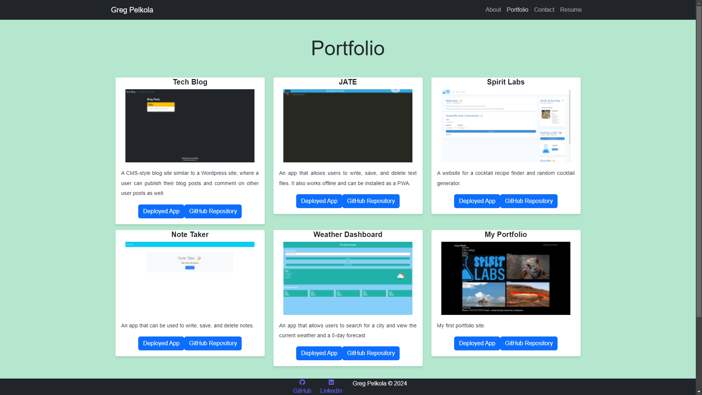

# portfolio2.0

## Description

Provide a short description explaining the what, why, and how of your project. Use the following questions as a guide:

- What was your motivation?

To update my portfolio using react, and everything else I have learned.

- Why did you build this project? (Note: the answer is not "Because it was a homework assignment.")

To have a nicer updated portfolio using react, for potential employers to look at

- What problem does it solve?

A professional looking react portfolio.

- What did you learn?

  React, styling, and debugging.

## Table of Contents (Optional)

If your README is long, add a table of contents to make it easy for users to find what they need.

- [Installation](#installation)
- [Usage](#usage)
- [Credits](#credits)
- [License](#license)

## Installation

What are the steps required to install your project? Provide a step-by-step description of how to get the development environment running.

Clone the repository, open in VsCode, in the terminal run npm i to install modules. Then run npm dev start to launch the webpage.

## Usage

https://effortless-smakager-92cb60.netlify.app/ -Deployed


https://github.com/gregpelkola/portfolio2.0   -Repository

Provide instructions and examples for use. Include screenshots as needed.

To add a screenshot, create an `assets/images` folder in your repository and upload your screenshot to it. Then, using the relative filepath, add it to your README using the following syntax:




When you first arrive on the webpage you will be loaded into a blank page landing page, using the navigation bar you can navigate to About, Portfolio, Contact and Resume. When you click on the navigation for the page you want to look at it will redirect you to that page. When on the About page you will see an image of me and information about me. When on the Portfolio page you will be able to click the buttons for each project to see the deployed application and the applications GitHub. When on the contact page, there will be a form to log user inputs and submit to contact me. On the resume page you will see a button to download my resume, and a list of my technical skills. 


    ```md
    
    ```

## Credits

List your collaborators, if any, with links to their GitHub profiles.

If you used any third-party assets that require attribution, list the creators with links to their primary web presence in this section.

If you followed tutorials, include links to those here as well.

## License

The last section of a high-quality README file is the license. This lets other developers know what they can and cannot do with your project. If you need help choosing a license, refer to [https://choosealicense.com/](https://choosealicense.com/).

---

🏆 The previous sections are the bare minimum, and your project will ultimately determine the content of this document. You might also want to consider adding the following sections.

## Badges


Badges aren't necessary, per se, but they demonstrate street cred. Badges let other developers know that you know what you're doing. Check out the badges hosted by [shields.io](https://shields.io/). You may not understand what they all represent now, but you will in time.

## Features

If your project has a lot of features, list them here.

## How to Contribute

If you created an application or package and would like other developers to contribute it, you can include guidelines for how to do so. The [Contributor Covenant](https://www.contributor-covenant.org/) is an industry standard, but you can always write your own if you'd prefer.

## Tests

Go the extra mile and write tests for your application. Then provide examples on how to run them here.
